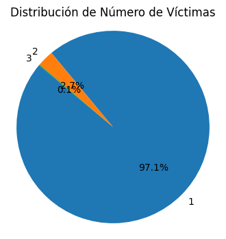
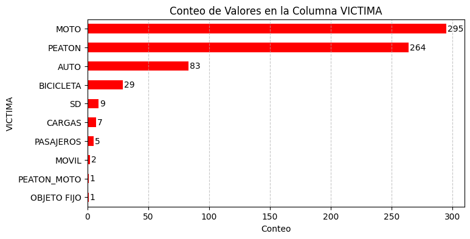
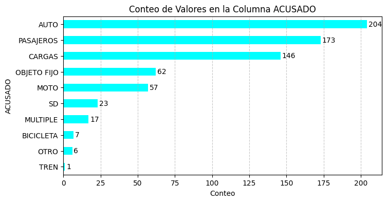
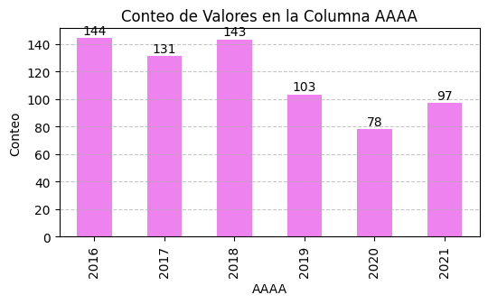
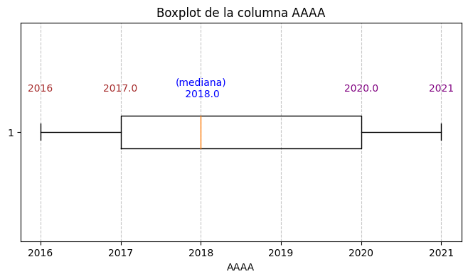
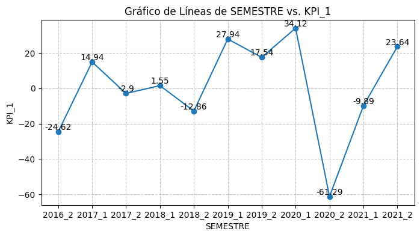
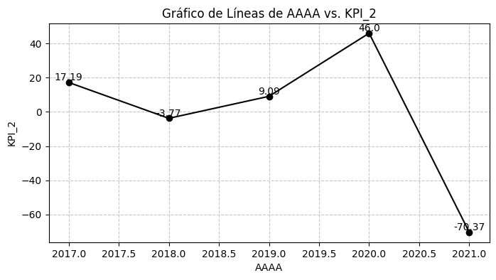
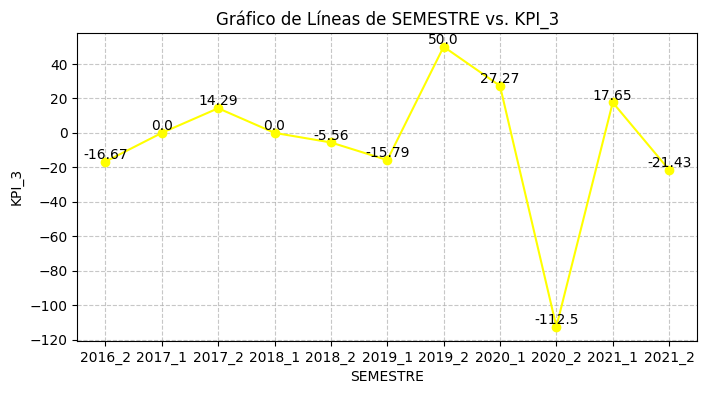

# <h1 align=center> **PROYECTO INDIVIDUAL Nº2**
# <h1 align=center> ** ANDRE MONTES **
### <h1 align=center> `Siniestros viales` (Data Analytics)

## 1- **Comprensión del negocio**

### **Observaciones y conclusiones:**

Se llevará a cabo un análisis de una base de datos recopilada entre 2016 y 2021 sobre accidentes viales en la Ciudad de Buenos Aires. Este análisis es crucial para reducir las tasas de mortalidad asociadas con estos incidentes mediante medidas preventivas.

Con el objetivo de establecer metas claras, se han definido tres objetivos principales junto con sus correspondientes indicadores clave de rendimiento (KPIs):

Objetivo 1: Reducción del 10% en la tasa de homicidios en siniestros viales en los últimos seis meses en comparación con el semestre anterior en CABA.

KPI 1: La tasa de homicidios en siniestros viales se define como el número de víctimas fatales en accidentes de tránsito por cada 100,000 habitantes en un área geográfica durante un período específico.
Fórmula 1: (Número de homicidios en siniestros viales / Población total) * 100,000.
Corrección Fórmula 1: Porcentaje de variación entre el semestre actual y el anterior, ajustado por la población.

Objetivo 2: Disminución del 7% en la cantidad de accidentes mortales de motociclistas en el último año en comparación con el año anterior en CABA.

KPI 2: La cantidad de accidentes mortales de motociclistas se define como el número absoluto de accidentes fatales en los que estuvieron involucradas víctimas que viajaban en moto en un periodo específico.
Fórmula 2: Porcentaje de variación entre el número de accidentes mortales con víctimas en moto del año actual y del año anterior.

Objetivo 3: Definido por el analista.

KPI 3: Indicador definido por el analista en concordancia con el Objetivo 3.
Fórmula 3: Fórmula diseñada por el analista según el KPI 3 y el objetivo correspondiente.

## 2- **Exploración inicial**

### **Conclusiones: df_hechos**

- ``ID``: categórico (str)
- ``N_VICTIMAS``: numérico (int).
- ``FECHA``: categórico (datetime.date).
- ``AAAA``: numérico (int).
- ``MM``: numérico (int).
- ``DD``: numérico (int).
- ``HORA``: numérico (datetime.time).
- ``HH``: numérico (int).
- ``LUGAR_DEL_HECHO``: categórico (str).
- ``TIPO_DE_CALLE``: categórico (str). 
- ``Calle``: categórico (str).
- ``Altura``: numérico (float).
- ``Cruce``: categórico (str).
- ``Dirección Normalizada``: categórico (str).
- ``COMUNA``: categórico (str).
- ``XY (CABA)``: categórico (str).
- ``pos x``: numérico (float).
- ``pos y``: numérico (float).
- ``PARTICIPANTES``: categórico (str).
- ``VICTIMA``: categórico (str).
- ``ACUSADO``: categórico (str).

## 3- **Planteamiento**

OBJETIVO 3:
Reducir en un 5% la cantidad de accidentes mortales en el último semestre en la Ciudad Autónoma de Buenos Aires (CABA), causados por el principal responsable de siniestros viales en comparación con el semestre anterior.

KPI 3: Definimos la cantidad de accidentes mortales ocasionados por el principal responsable de homicidios en siniestros viales del último semestre como el número total de accidentes fatales causados por dicho responsable en un periodo temporal específico.

FORMULA 3 (porcentaje de variación): Se calcula como {(número de accidentes mortales causados por el principal responsable de siniestros viales del último semestre en el semestre anterior - número de accidentes mortales causados por el mismo responsable en el semestre actual) / (número de accidentes mortales causados por el principal responsable de siniestros viales del último semestre en el semestre anterior)} * 100.
Para llevar a cabo este análisis, se requieren los siguientes datos:

KPI 1: Tasa de homicidios en siniestros viales

Semestre anterior
Número de homicidios en siniestros viales en el semestre anterior
Población total en el semestre anterior
Semestre actual
Número de homicidios en siniestros viales en el semestre actual
Población total en el semestre actual
KPI 2: Cantidad de accidentes mortales de motociclistas en siniestros viales

Víctimas: Motociclistas
Año anterior
Número de accidentes mortales en el año anterior involucrando motociclistas
Año actual
Número de accidentes mortales en el año actual involucrando motociclistas
KPI 3: Cantidad de accidentes mortales ocasionados por el principal responsable de homicidios en siniestros viales del último semestre

Mayor responsable de accidentes
Semestre anterior
Número de accidentes mortales causados por el mayor responsable en el semestre anterior
Semestre actual
Número de accidentes mortales causados por el mayor responsable en el semestre actual

Se debe importar un dataset que contenga la población anual por comuna extraído de la página oficial del gobierno `https://www.estadisticaciudad.gob.ar/eyc/?p=28146`

Se deben crear los siguientes campos necesarios en el análisis:
- `AAAA_SEMESTRE`: categórico (str). columna calculada a partir de la columna MM y el año actual
- `POBLACION_AAAA_SEMESTRE`: numérico (int). población anual por comuna
- `AAAA_SEMESTRE_ANTERIOR`: categórico (str).
- `POBLACION_AAAA_SEMESTRE_ANTERIOR`: numérico (int).
- `AAAA_ANTERIOR`: categórico (str)

Se mantienen los siguientes campos:
- `ID`: categórico (str). No se evidencian valores duplicados a través de la columna ID
- `N_VICTIMAS`: numérico (int).
- `AAAA`: numérico (int).
- `MM`: numérico (int). Elimianr despues de crear la columna SEMESTRE
- `VICTIMA`: categórico (str).
- `ACUSADO`: categórico (str).

Se eliminan los siguientes campos irrelevantes para el análisis de los KPIs
- `FECHA`
- `DD`
- `HORA`
- `HH`
- `LUGAR_DEL_HECHO`
- `TIPO_DE_CALLE`
- `Calle`
- `Altura`
- `Cruce`
- `Dirección Normalizada`
- ``COMUNA``
- `XY (CABA)`
- `pos x`
- `pos y`
- `PARTICIPANTES`

## 4- **Limpieza de datos**

## 5- **Enriquecimiento de columnas**

## 6- **Análisis Univariado**

### **df_hechos.N_VICTIMAS**

**Conclusiones**

-Solamente hay 3 posibilidades de victimas por accidente: 1, 2, 3
-La media del número de víctimas es aproximadamente 1.03, lo que sugiere que, en promedio, la mayoría de los accidentes tienen alrededor de una víctima.
-Dado que el 75% de los valores están en el primer cuartil, esto significa que el 75% de los accidentes tienen 1 víctima, y el segundo y tercer cuartiles son también 1. El valor máximo en el cuartil (75%) es 3, lo que indica que el 25% restante de los accidentes tiene 2 o 3 víctimas.
-Mayor frecuencia de numero de víctimas por accidente: 1 (97.13%)
-Menor frecuencia de numero de víctimas por accidente: 3 (0.14%)

**Conclusiones**

-Solamente hay 3 posibilidades de victimas por accidente: 1, 2, 3
-La media del número de víctimas es aproximadamente 1.03, lo que sugiere que, en promedio, la mayoría de los accidentes tienen alrededor de una víctima.
-Dado que el 75% de los valores están en el primer cuartil, esto significa que el 75% de los accidentes tienen 1 víctima, y el segundo y tercer cuartiles son también 1. El valor máximo en el cuartil (75%) es 3, lo que indica que el 25% restante de los accidentes tiene 2 o 3 víctimas.
-Mayor frecuencia de numero de víctimas por accidente: 1 (97.13%)
-Menor frecuencia de numero de víctimas por accidente: 3 (0.14%)

### **df_hechos.VICTIMA**

**Conclusiones**

-Hay 10 tipos diferentes de víctimas involucradas.
-El valor más frecuente es "MOTO". Esto significa que "MOTO" es el tipo de víctima más común en los accidentes registrados.
-la frecuencia del tipo de víctima más común ("MOTO") es 295. Esto significa que hubo 295 accidentes en los que estuvieron involucradas motocicletas como víctimas.
-Victima con mayor frecuencia en accidentes: "MOTO" (42.39%)
-Victima con menor frecuencia en accidentes: "PEATON_MOTO" (0.14 %)

### **df_hechos.ACUSADO**

**Conclusiones:**

-Hay 10 valores únicos en la columna "ACUSADO". Esto significa que existen 10 tipos diferentes de entidades o vehículos acusados en los accidentes registrados.
-El valor más frecuente en la columna "ACUSADO" es "AUTO". Esto significa que "AUTO" es el tipo de entidad o vehículo más comúnmente acusado en los accidentes registrados en el DataFrame.
-Indica que la frecuencia del tipo de entidad o vehículo más comúnmente acusado ("AUTO") es 204. Esto significa que hubo 204 accidentes en los que se acusó a un automóvil como la entidad responsable.
-Acusado con mayor frecuencia de accidentes: AUTO (29.31 %)
-Acusado con menor frecuencia de accidentes: TREN (0.14 %)

### **df_hechos.AAAA**

**Conclusiones**

-Hay 6 años únicos diferentes en la columna "AAAA", desde 2016 hasta 2021.
-(Cuartiles): Estos valores representan los cuartiles del conjunto de datos. Por ejemplo, el valor del primer cuartil (25%) es 2017, lo que significa que el 25% de los accidentes ocurrieron en 2017 o antes. El segundo cuartil (50%) es 2018, que es la mediana, indicando que el 50% de los accidentes ocurrieron en 2018 o antes. El tercer cuartil (75%) es 2020, lo que sugiere que el 75% de los accidentes ocurrieron en 2020 o antes.
-Año con mayor frecuencia de accidentes: 2016 (20.69%)
-Año con menor frecuencia de accidentes: 2020 (11.21%)

## 7- **Manejo de valores faltantes (nulos)**

## 8- **Análisis Multivariado**

### **KPI 1:** tasa de homicidios en siniestros viales

**Conclusiones:**

1.La primera medida que tomamos se basa en la comparación de los semestres 2016-1 y 2016-2, ya que no disponemos de datos previos al año 2016-1. Por lo tanto, solo observamos valores a partir del semestre 2016-2.

2.Si el valor en la gráfica para un semestre es positivo, indica que hubo una disminución en el número de homicidios en comparación con el semestre anterior.

3.Una pendiente positiva en la gráfica señala un aumento positivo en la diferencia de accidentes de motos en comparación con el semestre anterior.

4.El valor representado en la gráfica indica el porcentaje en el cual la tasa de homicidios en accidentes de tránsito se redujo respecto al semestre anterior. El objetivo es que este valor sea superior al 10%. Se logró este objetivo en los semestres:

2017-1: Hubo una reducción de homicidios mayor al 10% comparado con el semestre anterior.
2019-1: Se observó una reducción de homicidios mayor al 10% en comparación con el semestre anterior.
2019-2: Aunque hubo una reducción de homicidios, esta fue menor al 10% respecto al semestre anterior.
2021-2: La reducción de homicidios fue mayor al 10% en comparación con el semestre anterior.

5.De los 11 semestres analizados, solo 4 cumplieron el objetivo establecido, indicando que el balance general no es positivo según los criterios iniciales.

6.En 5 de los 11 semestres, se observó un porcentaje de cambio negativo, lo que significa un aumento en la tasa de homicidios en comparación con el semestre anterior. Aunque esta es una minoría, sigue siendo preocupante la frecuencia de este fenómeno.

### **KPI 2:** Cantidad de accidentes mortales de motociclistas en siniestros viales

**Conclusiones:**

1.Nuestra primera evaluación se centra en comparar los años 2016 y 2017, ya que no disponemos de datos previos al año 2016. Por lo tanto, los valores en la gráfica solo están visibles a partir del año 2017.

2.Un valor positivo en la gráfica para un año indica que hubo una disminución en el número de homicidios en comparación con el año anterior.

3.Si la gráfica muestra una pendiente positiva (creciente), significa que la diferencia de accidentes de motos en comparación con el año anterior ha aumentado de manera positiva.

4.El valor representado en la gráfica indica el porcentaje en el cual la cantidad de homicidios en accidentes de motos se redujo respecto al año anterior. El objetivo es que este valor sea superior al 7%. Se logró este objetivo en los años:

2017: Hubo una reducción de homicidios en comparación con el año anterior, pero al no tener valores para el año anterior, no podemos determinar si fue mayor o menor respecto a ese año.
2019: Se observó una reducción de homicidios mayor al 7% en comparación con el año anterior.
2020: La cantidad de homicidios en accidentes de motos se redujo más del 7% en comparación con el año anterior.

5.De los 5 años analizados, 3 cumplieron el objetivo establecido, indicando que el balance general es positivo según los criterios iniciales.

6.En 2 de los 5 años, se observó un porcentaje de cambio negativo, lo que significa un aumento en la tasa de accidentes en moto en comparación con el año anterior. Aunque es una minoría, sigue siendo preocupante la frecuencia de este fenómeno.

**Conclusiones:**

1.Identificamos al auto como el principal responsable de accidentes de tránsito durante el último semestre (2021-2), por lo que realizamos un análisis específico para este tipo de vehículo.

2.Dado que no disponemos de datos previos al año 2016, iniciamos nuestra evaluación comparando los semestres 2016-1 y 2016-2, y los valores en la gráfica son visibles a partir del semestre 2016-2.

3.n valor positivo en la gráfica para un semestre indica que hubo una disminución en la cantidad de accidentes ocasionados por autos en comparación con el semestre anterior.

4.Si la gráfica muestra una pendiente positiva (creciente), significa que la diferencia de accidentes ocasionados por autos en comparación con el semestre anterior ha aumentado de manera positiva.

5.El valor representado en la gráfica indica el porcentaje en el cual la cantidad de accidentes causados por autos se redujo respecto al semestre anterior. El objetivo es que este valor sea superior al 5%. Se logró este objetivo en los semestres:

2017-2: Se observó una reducción en los accidentes causados por autos en comparación con el semestre anterior, y esta diferencia fue mayor que la del semestre pasado.
2019-2: Hubo una disminución en los accidentes causados por autos respecto al semestre anterior, siendo la diferencia mayor que en el semestre pasado.
2020-1: Se registró una reducción en los accidentes causados por autos en comparación con el semestre anterior, aunque la diferencia fue menor que en el semestre pasado.
2021-1: Se evidenció una disminución en los accidentes causados por autos frente al semestre anterior, y esta diferencia fue mayor que en el semestre pasado.

6.De los 11 semestres analizados, solo 4 cumplieron el objetivo establecido, indicando que el balance general no es positivo según los criterios iniciales.

7.En 5 de los 11 semestres, se observó un porcentaje de cambio negativo, indicando un aumento en la cantidad de accidentes ocasionados por autos en comparación con el semestre anterior. Aunque es una minoría, la frecuencia sigue siendo preocupante.
