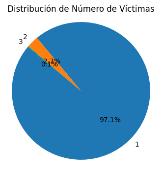
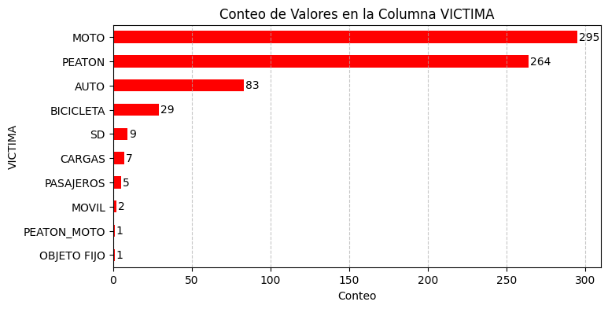
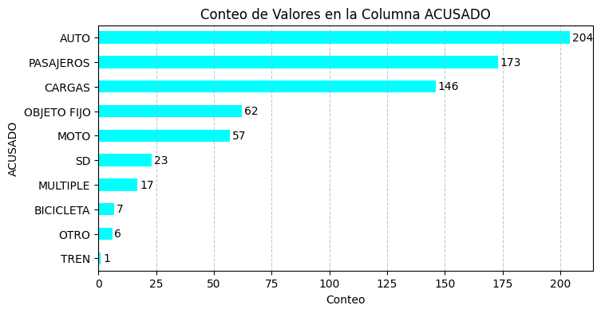
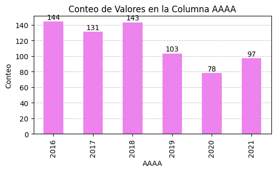
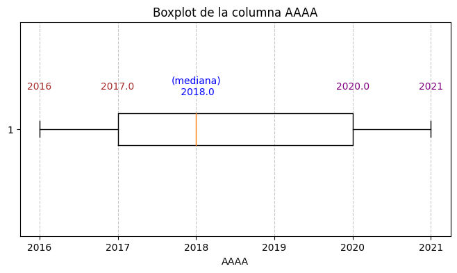
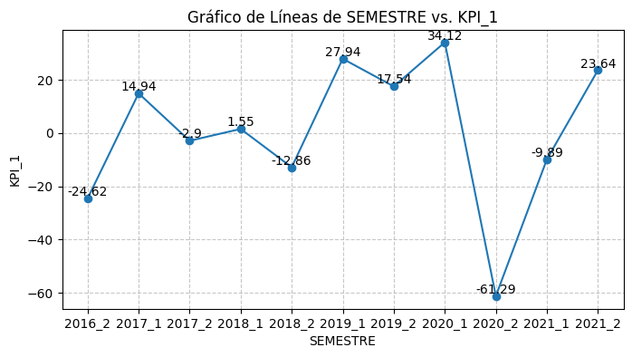
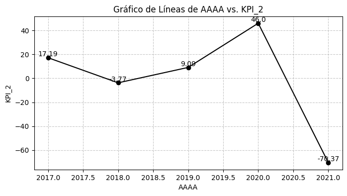
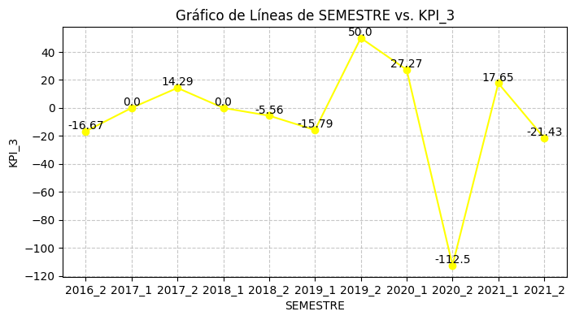

# 🚗 **PROYECTO INDIVIDUAL Nº2** 

## 📊 `Análisis de Siniestros Viales en CABA (2016-2021)`

### 🌟 **Autor:** Andre Montes

---

## 1- **Comprensión del negocio**

### 🚦 **Overview**
Este proyecto analiza los datos de accidentes de tránsito en la Ciudad de Buenos Aires (CABA) entre 2016 y 2021 con el objetivo de identificar patrones y reducir la mortalidad asociada a estos incidentes. Los insights derivados están orientados a apoyar iniciativas de seguridad pública y medidas preventivas.

### 🎯 **Objetivos del Proyecto & KPIs**  
1. **Reducir en un 10% la tasa de homicidios en accidentes viales**  
   - **KPI**: Tasa de homicidios por cada 100,000 habitantes  
   - **Fórmula**: `(Número de víctimas fatales / Población total) * 100,000`
   - **Objetivo**: Comparar la tasa en dos semestres consecutivos, ajustada por la población.
   
2. **Disminuir en un 7% los accidentes mortales de motociclistas**  
   - **KPI**: Número absoluto de accidentes mortales de motociclistas  
   - **Fórmula**: Variación porcentual entre el año actual y el anterior.
   
3. **Objetivo definido por el analista**  
   - **KPI**: A definir en función de los análisis adicionales.

## 2- **Exploración inicial**

El conjunto de datos contiene información detallada sobre los siniestros viales en CABA, incluyendo fecha, lugar, número de víctimas y tipos de participantes. Algunos de los campos clave son:

### **Conclusiones: df_hechos**

- ``ID``: categórico (str)
- ``N_VICTIMAS``: numérico (int).
- ``FECHA``: categórico (datetime.date).
- ``AAAA``: numérico (int).
- ``MM``: numérico (int).
- ``DD``: numérico (int).
- ``HORA``: numérico (datetime.time).
- ``HH``: numérico (int).
- ``LUGAR_DEL_HECHO``: categórico (str).
- ``TIPO_DE_CALLE``: categórico (str). 
- ``Calle``: categórico (str).
- ``Altura``: numérico (float).
- ``Cruce``: categórico (str).
- ``Dirección Normalizada``: categórico (str).
- ``COMUNA``: categórico (str).
- ``XY (CABA)``: categórico (str).
- ``pos x``: numérico (float).
- ``pos y``: numérico (float).
- ``PARTICIPANTES``: categórico (str).
- ``VICTIMA``: categórico (str).
- ``ACUSADO``: categórico (str).

## 3- **Planteamiento**

## Objetivo 3: 
**Reducir en un 5% la cantidad de accidentes mortales en el último semestre en la Ciudad Autónoma de Buenos Aires (CABA), causados por el principal responsable de siniestros viales en comparación con el semestre anterior.**

### KPI 3: 
**Cantidad de accidentes mortales ocasionados por el principal responsable de homicidios en siniestros viales del último semestre.**  
El KPI se define como el número total de accidentes fatales causados por dicho responsable en un periodo temporal específico.

### Fórmula 3 (Porcentaje de variación):
Se calcula utilizando la siguiente fórmula:

 ``(porcentaje de variación): {(número de accidentes mortales causados por el principal responsable de siniestros viales del último semestre en el semestre anterior - número de accidentes mortales causados por el mismo responsable en el semestre actual) /(número de accidentes mortales causados por el principal responsable de siniestros viales del último semestre en el semestre anterior)} * 100.``
 
### Datos requeridos para el análisis:

#### KPI 1: Tasa de homicidios en siniestros viales
- **Semestre anterior:**
  - Número de homicidios en siniestros viales
  - Población total
- **Semestre actual:**
  - Número de homicidios en siniestros viales
  - Población total

#### KPI 2: Cantidad de accidentes mortales de motociclistas en siniestros viales
- **Víctimas:** Motociclistas
  - **Año anterior:**
    - Número de accidentes mortales involucrando motociclistas
  - **Año actual:**
    - Número de accidentes mortales involucrando motociclistas

#### KPI 3: Cantidad de accidentes mortales ocasionados por el principal responsable de homicidios en siniestros viales
- **Principal responsable de accidentes**
  - **Semestre anterior:**
    - Número de accidentes mortales causados por el mayor responsable
  - **Semestre actual:**
    - Número de accidentes mortales causados por el mayor responsable

Se debe importar un dataset que contenga la población anual por comuna extraído de la página oficial del gobierno `https://www.estadisticaciudad.gob.ar/eyc/?p=28146`

Se deben crear los siguientes campos necesarios en el análisis:
- `AAAA_SEMESTRE`: categórico (str). columna calculada a partir de la columna MM y el año actual
- `POBLACION_AAAA_SEMESTRE`: numérico (int). población anual por comuna
- `AAAA_SEMESTRE_ANTERIOR`: categórico (str).
- `POBLACION_AAAA_SEMESTRE_ANTERIOR`: numérico (int).
- `AAAA_ANTERIOR`: categórico (str)

Se mantienen los siguientes campos:
- `ID`: categórico (str). No se evidencian valores duplicados a través de la columna ID
- `N_VICTIMAS`: numérico (int).
- `AAAA`: numérico (int).
- `MM`: numérico (int). Elimianr despues de crear la columna SEMESTRE
- `VICTIMA`: categórico (str).
- `ACUSADO`: categórico (str).

Se eliminan los siguientes campos irrelevantes para el análisis de los KPIs
- `FECHA`
- `DD`
- `HORA`
- `HH`
- `LUGAR_DEL_HECHO`
- `TIPO_DE_CALLE`
- `Calle`
- `Altura`
- `Cruce`
- `Dirección Normalizada`
- ``COMUNA``
- `XY (CABA)`
- `pos x`
- `pos y`
- `PARTICIPANTES`

## 4- **Limpieza de datos**

## 5- **Enriquecimiento de columnas**

## 6- **Análisis Univariado**

### Número de Víctimas por Accidente (`df_hechos.N_VICTIMAS`)

**Conclusiones:**

- Existen solo 3 posibilidades de víctimas por accidente: 1, 2, 3.
- La media del número de víctimas es aproximadamente 1.03, lo que sugiere que, en promedio, la mayoría de los accidentes tienen alrededor de una víctima.
- El 75% de los valores están en el primer cuartil, lo que significa que el 75% de los accidentes tienen 1 víctima. Los segundos y terceros cuartiles también son 1. El valor máximo en el cuartil (75%) es 3, indicando que el 25% restante de los accidentes tiene 2 o 3 víctimas.
- La mayor frecuencia de número de víctimas por accidente es 1 (97.13%).
- La menor frecuencia de número de víctimas por accidente es 3 (0.14%).

### Tipo de Víctima (`df_hechos.VICTIMA`)

**Conclusiones:**

- Hay 10 tipos diferentes de víctimas involucradas.
- El tipo de víctima más frecuente es "MOTO", con 295 incidentes registrados, lo que representa el 42.39% de los casos.
- La víctima con menor frecuencia en accidentes es "PEATON_MOTO" (0.14%).

### Entidad o Vehículo Acusado (`df_hechos.ACUSADO`)

**Conclusiones:**

- Existen 10 valores únicos en la columna "ACUSADO", lo que indica 10 tipos diferentes de entidades o vehículos acusados en los accidentes.
- El tipo de entidad o vehículo más frecuentemente acusado es "AUTO", con 204 incidentes registrados, representando el 29.31% de los casos.
- La entidad con menor frecuencia de accidentes es "TREN" (0.14%).

### Año de Accidente (`df_hechos.AAAA`)

**Conclusiones:**

- Los datos cubren 6 años únicos, desde 2016 hasta 2021.
- Los cuartiles indican lo siguiente:
  - Primer cuartil (25%): 2017
  - Mediana (50%): 2018
  - Tercer cuartil (75%): 2020
- El año con mayor frecuencia de accidentes es 2016 (20.69%).
- El año con menor frecuencia de accidentes es 2020 (11.21%).

## 7- **Manejo de valores faltantes (nulos)**

## 8- **Análisis Multivariado**

### **KPI 1: Tasa de Homicidios en Siniestros Viales**

**Conclusiones:**

1. La primera medida se basa en la comparación de los semestres 2016-1 y 2016-2, ya que no disponemos de datos previos a 2016-1. Los valores se observan a partir del semestre 2016-2.
2. Un valor positivo en la gráfica indica una disminución en el número de homicidios en comparación con el semestre anterior.
3. Una pendiente positiva señala un aumento positivo en la diferencia de accidentes de motos en comparación con el semestre anterior.
4. El valor representado en la gráfica indica el porcentaje en el que la tasa de homicidios en accidentes de tránsito se redujo respecto al semestre anterior. El objetivo es que este valor sea superior al 10%. Se logró este objetivo en los semestres:
   - **2017-1:** Reducción de homicidios mayor al 10% comparado con el semestre anterior.
   - **2019-1:** Reducción de homicidios mayor al 10% comparado con el semestre anterior.
   - **2019-2:** Reducción de homicidios menor al 10% comparado con el semestre anterior.
   - **2021-2:** Reducción de homicidios mayor al 10% comparado con el semestre anterior.
5. De los 11 semestres analizados, solo 4 cumplieron el objetivo, indicando que el balance general no es positivo según los criterios iniciales.
6. En 5 de los 11 semestres, se observó un porcentaje de cambio negativo, lo que significa un aumento en la tasa de homicidios comparado con el semestre anterior. Aunque es una minoría, la frecuencia es preocupante.

### **KPI 2: Cantidad de Accidentes Mortales de Motociclistas en Siniestros Viales**

**Conclusiones:**

1. La evaluación se centra en comparar los años 2016 y 2017, ya que no hay datos previos a 2016. Los valores en la gráfica están visibles a partir del año 2017.
2. Un valor positivo en la gráfica indica una disminución en el número de homicidios en comparación con el año anterior.
3. Una pendiente positiva significa que la diferencia de accidentes de motos en comparación con el año anterior ha aumentado de manera positiva.
4. El valor en la gráfica indica el porcentaje en el que la cantidad de homicidios en accidentes de motos se redujo respecto al año anterior. El objetivo es que este valor sea superior al 7%. Se logró este objetivo en los años:
   - **2017:** Reducción de homicidios comparado con el año anterior, pero sin valores previos para comparación.
   - **2019:** Reducción de homicidios mayor al 7% comparado con el año anterior.
   - **2020:** Reducción de homicidios mayor al 7% comparado con el año anterior.
5. De los 5 años analizados, 3 cumplieron el objetivo, indicando un balance positivo según los criterios iniciales.
6. En 2 de los 5 años, se observó un porcentaje de cambio negativo, lo que significa un aumento en la tasa de accidentes en moto comparado con el año anterior. Aunque es una minoría, la frecuencia es preocupante.

### **KPI 3: Cantidad de Accidentes Mortales Ocasionados por el Mayor Responsable de Homicidios en Siniestros Viales del Último Semestre**

**Conclusiones:**

1. El auto se identificó como el principal responsable de accidentes de tránsito durante el último semestre (2021-2), y se realizó un análisis específico para este tipo de vehículo.
2. La evaluación inicia comparando los semestres 2016-1 y 2016-2, con valores visibles a partir del semestre 2016-2.
3. Un valor positivo en la gráfica indica una disminución en la cantidad de accidentes ocasionados por autos comparado con el semestre anterior.
4. Una pendiente positiva significa que la diferencia de accidentes ocasionados por autos comparado con el semestre anterior ha aumentado de manera positiva.
5. El valor en la gráfica indica el porcentaje en el que la cantidad de accidentes causados por autos se redujo respecto al semestre anterior. El objetivo es que este valor sea superior al 5%. Se logró este objetivo en los semestres:
   - **2017-2:** Reducción en los accidentes causados por autos comparado con el semestre anterior, con una diferencia mayor.
   - **2019-2:** Disminución en los accidentes causados por autos comparado con el semestre anterior, con una diferencia mayor.
   - **2020-1:** Reducción en los accidentes causados por autos comparado con el semestre anterior, aunque la diferencia fue menor.
   - **2021-1:** Disminución en los accidentes causados por autos comparado con el semestre anterior, con una diferencia mayor.
6. De los 11 semestres analizados, solo 4 cumplieron el objetivo, indicando que el balance general no es positivo según los criterios iniciales.
7. En 5 de los 11 semestres, se observó un porcentaje de cambio negativo, indicando un aumento en la cantidad de accidentes ocasionados por autos comparado con el semestre anterior. Aunque es una minoría, la frecuencia sigue siendo preocupante.
